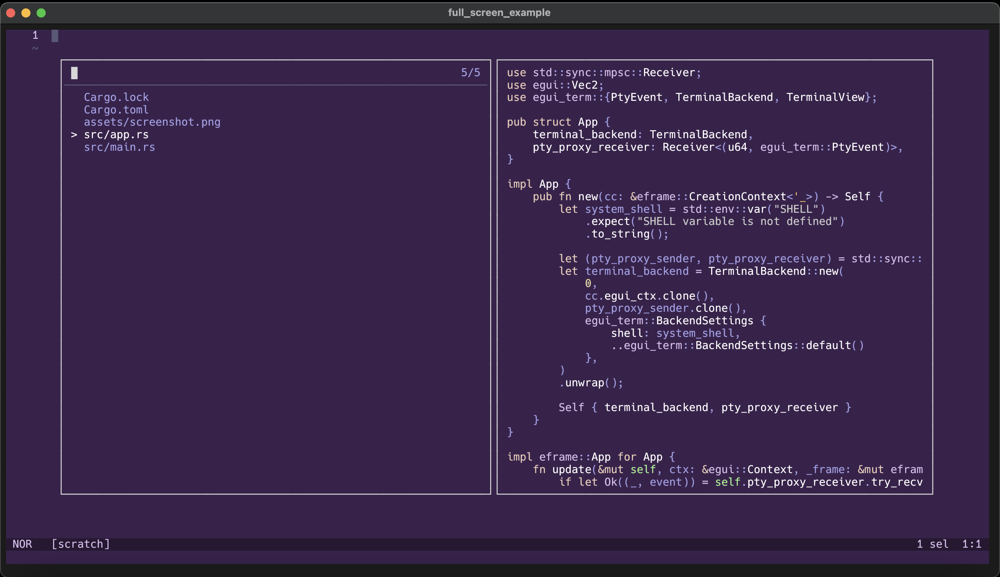
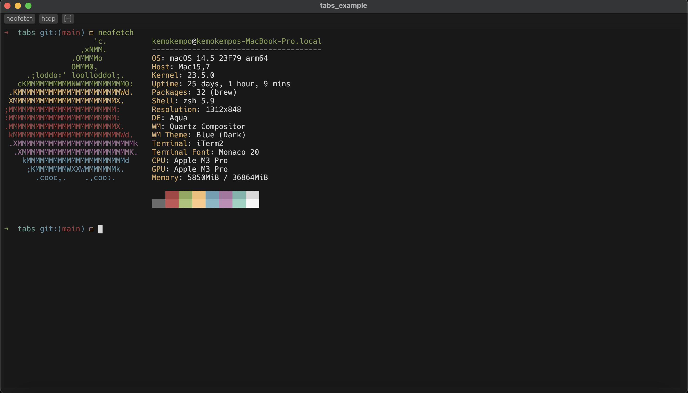

<div align="center">

# egui_term


Terminal emulator widget powered by EGUI framework and alacritty terminal backend.

<a href="./examples/full_screen.rs">
  
</a>
<a href="./examples/tabs.rs">
  
</a>

</div>

## Features

The widget is currently under development and does not provide full terminal features make sure that widget is covered everything you want.

- PTY content rendering
- Multiple instance support
- Basic keyboard input
- Adding custom keyboard or mouse bindings
- Resizing
- Scrolling
- Focusing
- Selecting
- Changing Font/Color scheme
- Hyperlinks processing (hover/open)

This widget tested on MacOS and Linux and is not tested on Windows.

## Examples

You can also look at [examples](./examples) directory for more information about widget using.

- [full_screen](./examples/full_screen.rs) - The basic example of terminal emulator.
- [tabs](./examples/tabs.rs) - The example with tab widget that show how multiple instance feature work.
- [custom_bindings](./examples/custom_bindings.rs) - The example that show how you can add custom keyboard or mouse bindings to your terminal emulator app.
- [themes](./examples/themes.rs) - The example that show how you can change terminal color scheme.
- [fonts](./examples/fonts.rs) - The examples that show how you can change font type or font size in your terminal emulator app.
- [dock](./examples/dock.rs) - The example that shows how you can use terminal in dock.

## Running examples
```
$ git clone https://github.com/Harzu/egui_term.git
$ cd egui_term
$ cargo run --example [example_name]
```

## Dependencies

 - [egui (0.30)](https://github.com/emilk/egui)
 - [alacritty_terminal (custom commit)](https://github.com/zed-industries/zed/pull/12687/files)
